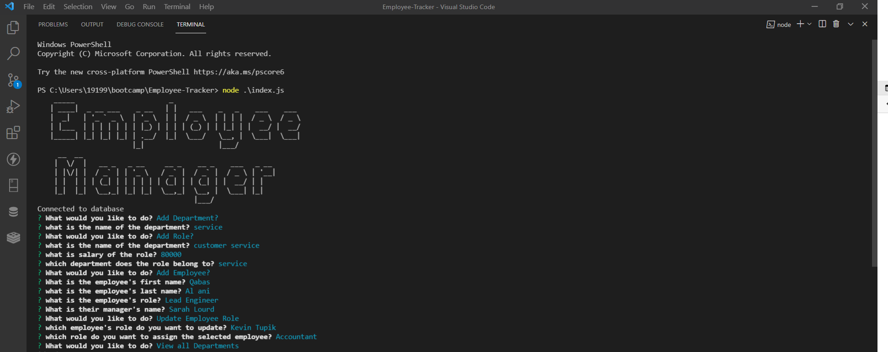
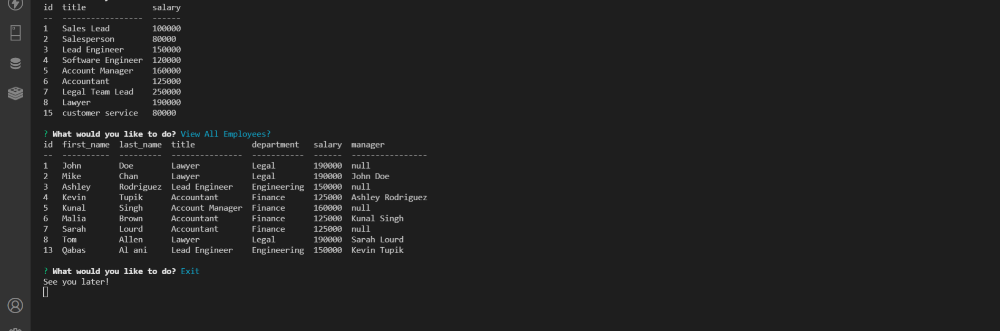
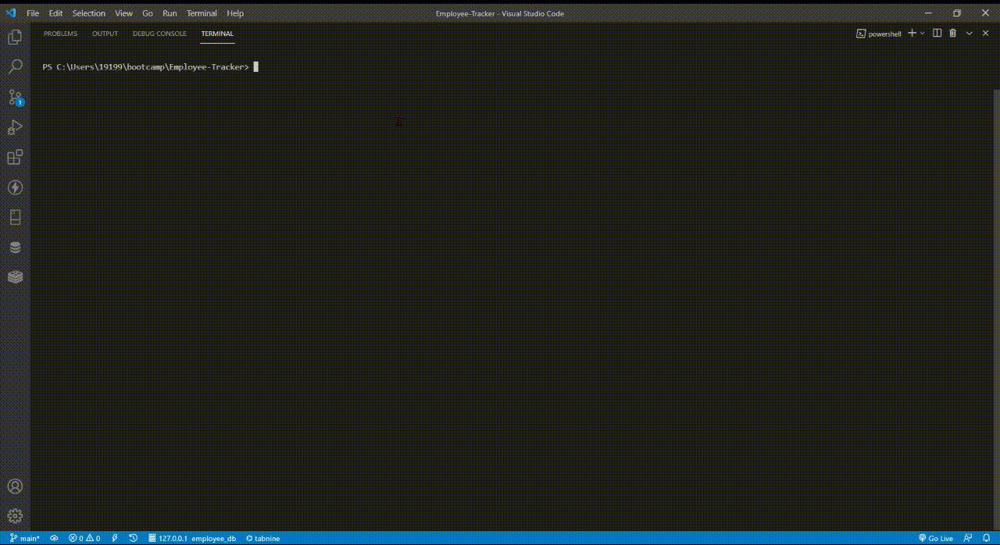

# Employee Tracker SQL
  ----
  [](https://opensource.org/licenses/MIT)
## Table of Contents
- [Description](#description)
- [Installation](#installation)
- [Technologies](#technologies)
- [Usage](#usage)
- [Contribution](#contribution)
- [Questions](#questions)

## Description:
This is back end project that allows users to track their employees or add new employees or managers and set them right in specific tables in data base and show their position in the company and their salaries depends on their position and in case if you want to add new department to the actual table you the choice for that two.  


## Technologies
```
- JavaScript.
- Node.js.
- SQL.
- Mysql.
- Mysql2 npm package.
- Console.table.
- Promise mysql.
- inquirer.
- figlet.
```

### Installation
```
npm install
```

### Usage
Add employee, update employee role, view department, view all roles and employees.


### Contribution
```
Contributions, issues, and feature requests are welcome!
Give a ⭐️ if you like this project!
```

### A Screenshot of my deployed Employee Tracker Sql

 
 
 




[full demo video]( https://drive.google.com/file/d/1Jssv3vnw-vAK_DOsbdNFvHUOhallRXyE/view?usp=sharing )

### Questions? 
For any questions, please contact me with the information below:

doctorqa@yahoo.com

[LinkedIn Profile](https://www.linkedin.com/in/qabas-al-ani-7b858863/)

[Github Profile](https://github.com/Qabas-al-ani)
